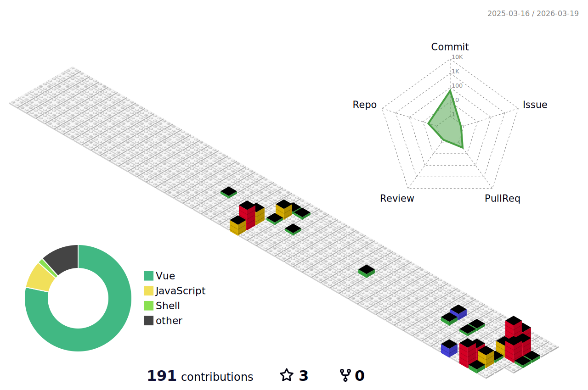

## Hi, i'm Victor Canseco
<h4>DevSecOps · Consultor de Automatización con IA | Templates .NET + Vue para Developers LATAM | Azure · Claude AI · n8n · Azure · C# · SQL Server ·</h4>

<h3>Soy Ingeniero de Software con más de 18 años de experiencia construyendo 
sistemas robustos y escalables. Hoy combino esa experiencia con IA y 
automatizaciones para ayudar a developers y empresas LATAM a lanzar 
productos más rápido y eliminar procesos manuales que consumen tiempo valioso.

Creo dos tipos de productos:

🧱 TEMPLATES para Developers: Boilerplates production-ready en .NET 8 + Vue 3 
+ PostgreSQL + Stripe + Azure. Documentados en español. Sin semanas de 
configuración inicial. Lanzas tu SaaS o proyecto en días, no meses.

🤖 AUTOMATIZACIONES con IA: Conecto los sistemas de tu empresa con flujos 
inteligentes usando n8n, Make y Claude AI. Desde atención al cliente automática 
hasta reportes semanales que se generan solos.</h3>

<h3>
Mi stack: .NET  · Node.js · Vue 3 · SQL Server · PostgreSQL · Azure · 
Docker · GitHub Actions · Azure DevOps · Claude AI · n8n</h3>

- 📫 How to reach me: [Twitter]

[Twitter]: https://twitter.com/vcdevai "Twitter"

  

 

<h3 align="left">Connect with me:</h3>

<h3 align="left">Languages and Tools:</h3>

 
 

